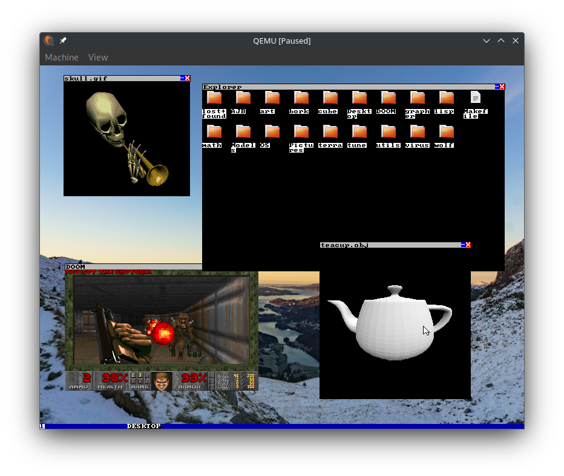

# Greenwood Operating System



### Whats it for?

My own personal exploration of low level system concepts.   
Built using the idea of "what if your computer had no rules."  

### So you've got questions
* Is it good? - Probably not.
* Should I use it? - Absolutely not.
* Will it beat Linux? - I sure hope it won't.
* What does it do? - Definitely will try to nuke your hard drive on physical hardware. Maybe overheat your CPU. Otherwise, terrible UI, program management, and awful memory manager.


# Requirements

* grub-mkrescue
* xorriso
* gcc/g++
* qemu
* make

# How to build

Simple compilation:
```bash
make build
```

Compile and run in Qemu:
```bash
make
```

Clean build files:
```bash
make clean
```

Building the filesystem
```bash
make -C filesystem

make make_ext2
#/\ mounts an image to the filesystem, will ask for sudo
```
